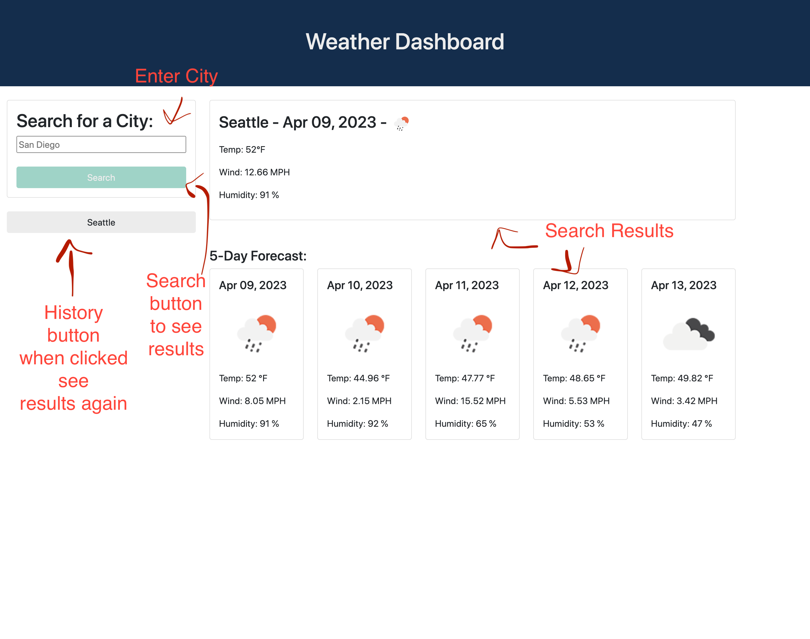

# Weather Dashboard website
```
    This website will let you see the current weather and a 5 day forecast for a specific city. 
    You will be able to enter a city name and see on the right side the current and forecast weather.
    Your selected city will appear on the left side below the search button.
    Then you will be able to click on that history and see the city weather info again in the left side 
    of the page.  
```
I've learned a lot from using the weather API and how to manipulate or get certain information for my website. 
I've looked through a lot of the material in class and the documentation available in the https://openweathermap.org/api
If I had a problem with the code and needed more information I went through w3schools.com and tackoverflow.com . 
I used Bootstrap to design the html and styling and day.js.org for current date info/format. 

Here are some screenschots and links to website and repo:

## Links
Github Repo : https://github.com/caroHagg/Weather-Dashboard

website : https://carohagg.github.io/Weather-Dashboard



